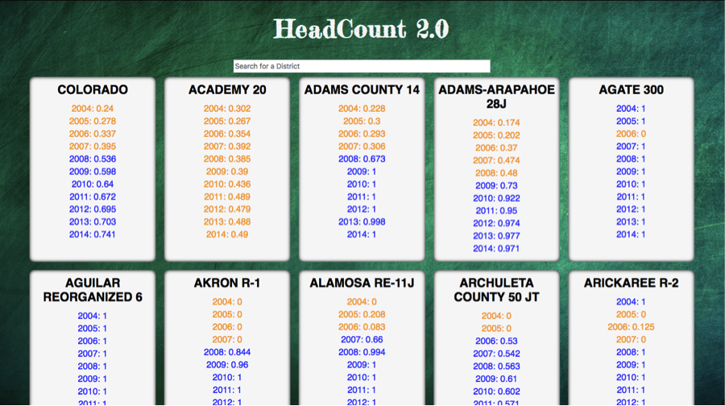
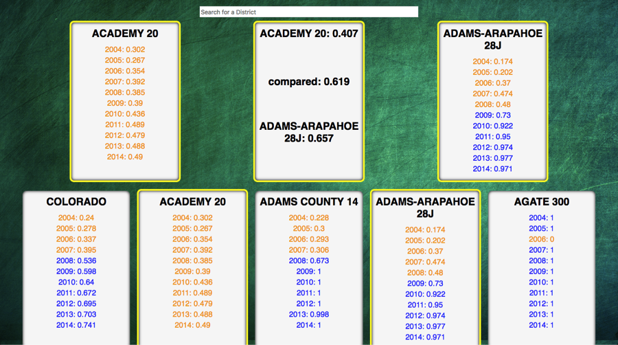

# HeadCount 2.0

HeadCount 2.0 is a project designed to challenge your skills at manipulating data and creating small, reusable React components.

This application was built using the `create-react-app` boilerplate.

## Project Goals

- Separate application logic into small, testable functions.
- Create modular, reusable React components.
- Use propTypes to validate props passed to each component.
- Write meaningful, comprehensive unit and integration tests.

## Landing Page:

## Comparison Page:

# HeadCount 2.0

HeadCount 2.0 is a project designed to challenge your skills at manipulating data and creating small, reusable React components.

This application was built using the `create-react-app` boilerplate.

## Project Goals

- Separate application logic into small, testable functions.
- Create modular, reusable React components.
- Use propTypes to validate props passed to each component.
- Write meaningful, comprehensive unit and integration tests.

## Landing Page:

## Comparison Page:

